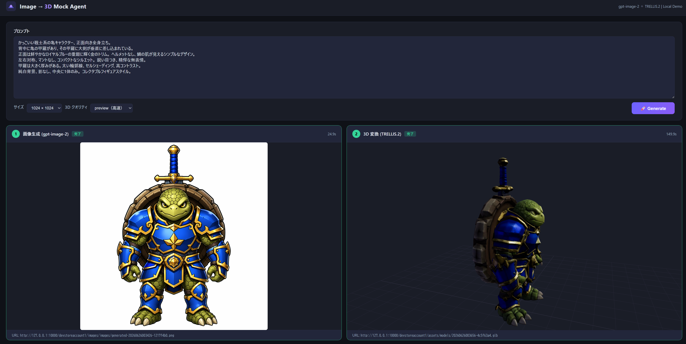

# image-to-3d-mock-agent
Microsoft Foundry Agent から画像生成と Image-to-3D 変換を実行し、3D モックを生成するデモコード

詳細な仕様は [SPEC.md](SPEC.md) を参照してください。

## デモ



> テキストプロンプトから AI 画像を生成（左）し、TRELLIS.2 で 3D モデルに変換（右）するエンドツーエンドのデモ画面。

## コンポーネント構成

| コンポーネント | 役割 | ポート |
|---|---|---|
| `ImageTo3DMockAgent.Functions` | 画像生成 Azure Functions（gpt-image-2 → Blob 保存） | 7072 |
| `ImageTo3DMockAgent.Api` | 3D 変換 Azure Functions（Mock または TRELLIS） | 7071 |
| `trellis_api/main.py` | TRELLIS FastAPI ラッパー（HuggingFace Space 経由） | 8080 |
| `demo/server.py` | デモ UI プロキシサーバー | 9000 |
| `trellis_api/inspector_agent.py` | デバッグ用 Foundry Agent | 8088 |

## ローカル起動手順

### 前提

- [Azure Functions Core Tools v4](https://learn.microsoft.com/azure/azure-functions/functions-run-local)
- [Azurite](https://learn.microsoft.com/azure/storage/common/storage-use-azurite)（ローカル Blob エミュレーター）
- Python 3.10 以上
- .NET 8 SDK
- （TRELLIS モードのみ）[HuggingFace](https://huggingface.co/) アカウントと `HF_TOKEN`。ZeroGPU の無料枠は月 5 分のため、継続利用には [Pro プラン](https://huggingface.co/pricing)（月 40 分）を推奨します。

### 設定ファイルの準備

各サービスの `local.settings.json.example` を `local.settings.json` としてコピーし、必要な値を設定してください。

```bash
# Windows
copy src\ImageTo3DMockAgent.Functions\local.settings.json.example src\ImageTo3DMockAgent.Functions\local.settings.json
copy src\ImageTo3DMockAgent.Api\local.settings.json.example src\ImageTo3DMockAgent.Api\local.settings.json

# macOS / Linux
cp src/ImageTo3DMockAgent.Functions/local.settings.json.example src/ImageTo3DMockAgent.Functions/local.settings.json
cp src/ImageTo3DMockAgent.Api/local.settings.json.example src/ImageTo3DMockAgent.Api/local.settings.json
```

> `local.settings.json` は `.gitignore` により Git 管理外です。シークレットを誤ってコミットしないよう注意してください。

### 1. Azurite を起動

```bash
azurite --location .azurite
```

### 2. ImageTo3DMockAgent.Functions（画像生成、ポート 7072）

```bash
cd src/ImageTo3DMockAgent.Functions
func start --port 7072
```

### 3. ImageTo3DMockAgent.Api（3D 変換、ポート 7071）

```bash
# リポジトリルートの start-api.bat を使うと便利です
start-api.bat
```

モックモードで起動する場合は `local.settings.json` の `IMAGE_TO_3D_API_ENDPOINT` を空にしてください。

### 4. TRELLIS API（オプション、ポート 8080）

```bash
cd trellis_api
pip install -r requirements.txt
HF_TOKEN=<your_huggingface_token> uvicorn trellis_api.main:app --host 127.0.0.1 --port 8080
```

TRELLIS モードを有効にするには `src/ImageTo3DMockAgent.Api/local.settings.json` に以下を設定します。

```json
"Trellis__ApiEndpoint": "http://127.0.0.1:8080",
"IMAGE_TO_3D_API_ENDPOINT": "http://127.0.0.1:8080/generate-3d"
```

### 5. デモ UI（ポート 9000）

```bash
cd demo
pip install -r requirements.txt
uvicorn server:app --host 127.0.0.1 --port 9000
```

ブラウザで `http://localhost:9000/` を開くと画像生成 → 3D 変換をエンドツーエンドで試せます。

## API

### POST `/api/generate-image`（ポート 7072）

```json
{
  "prompt": "白背景の前面向きスマートフォンのモックアップ",
  "size": "1024x1024"
}
```

レスポンス:

```json
{
  "imageUrl": "http://127.0.0.1:10000/devstoreaccount1/assets/images/generated-....png",
  "imageBlobPath": "images/generated-....png"
}
```

### POST `/api/generate-3d`（ポート 7071）

```json
{
  "imageUrl": "https://<storage-account>.blob.core.windows.net/<container>/images/sample.png",
  "imageBlobPath": "images/sample.png",
  "outputFormat": "glb",
  "quality": "preview"
}
```

- `imageUrl` または `imageBlobPath` のどちらかが必須です
- `outputFormat` は `glb` / `obj` に対応し、既定値は `glb` です
- `quality` は `preview` / `standard` / `high` に対応し、既定値は `preview` です

レスポンス:

```json
{
  "modelUrl": "https://<storage-account>.blob.core.windows.net/<container>/models/sample.glb",
  "modelBlobPath": "models/sample.glb",
  "sourceImageUrl": "https://<storage-account>.blob.core.windows.net/<container>/images/sample.png"
}
```


必要に応じて `MockAssetStorage__SourceImageBaseUrl` と `MockAssetStorage__ModelBaseUrl` 環境変数で画像/モデルのベース URL を上書きできます。


